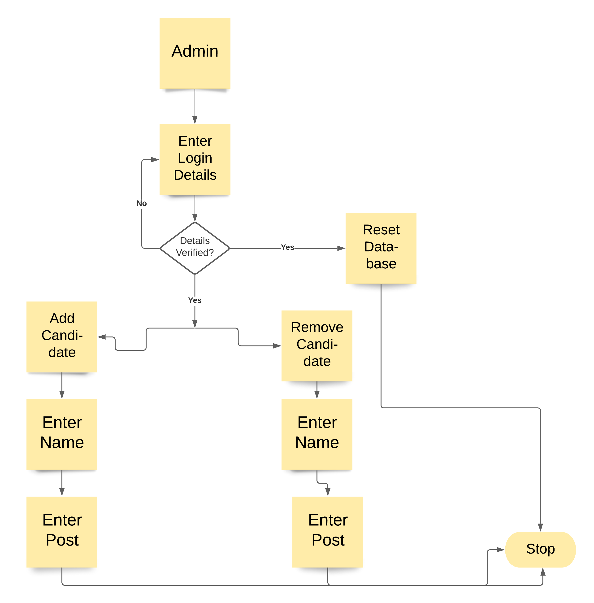
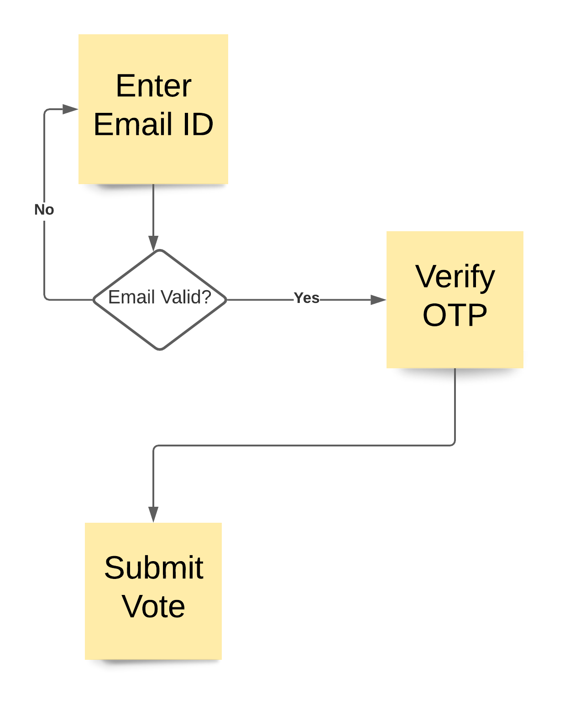
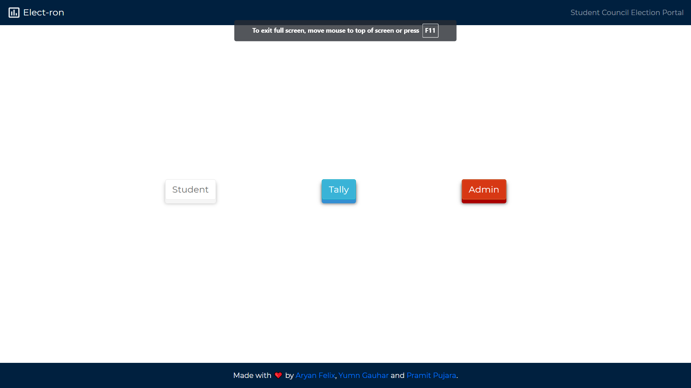
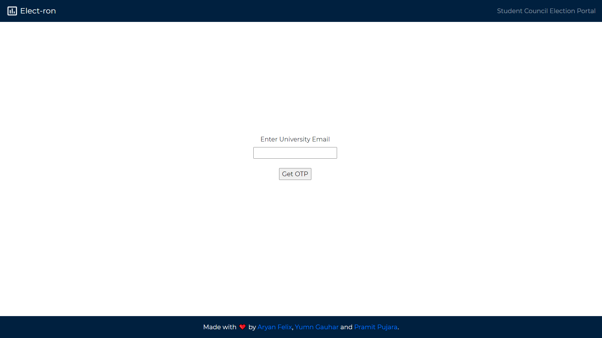
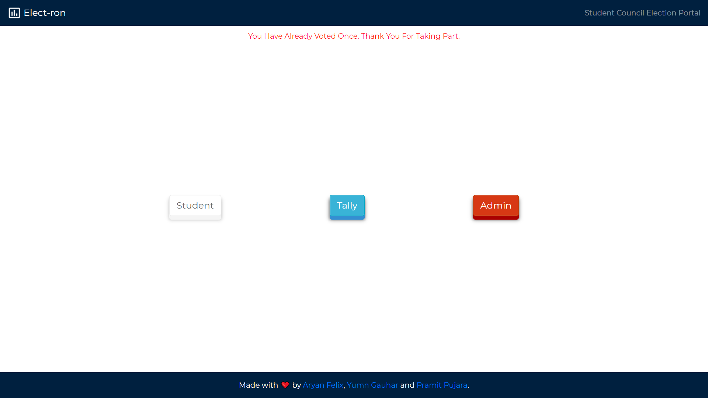

## Team Number \14 - \Elect-ron : The E-vote app for student body elections

### Project Overview

* Problem Definition
    > It's corona time. Voting in this typical scenario in student council elections have become stalled. The method of using paper ballots/physical voting in a center cannot be conducted and is often more cumbersome, time-consuming. There are a number offactors like going to polling stations, long waiting queues, bad weather conditions, traffic etc. make traditional elections difficultfor voters as well as for the officials. These factors often results in decrease of voters’ participation in the election process.

* Solution Strategy
    > Online e-Voting is a critical step for the evolution of the voting process. It is an ideal means for elections of college council in this pandemic and even in normal times as we have achieved advancement in technology, peneration of internet and knowldege of security that a free and fair election can be conducted which is accessible to all memebers of the society.

    >Elect-ron developed for college students to cast their votes anytime and from anywhere using browsers.  The aim of this app is to provide convenience to voters as well as officials who monitor the voting process. The appg gives election results accurately and instantaneously.

### Solution Description

>The app has an easy to use interface “Login Screen” for voters where they can login with their College ids. Each voter’sdata is stored in database containing their essential information such as College email account id and a votingstatus which stores whether voter  has voted or not. After login, voters have access to voting interface “Voting Screen” that allows them to select candidates for the given positions and submit their voting data securely. Once a voter submits his/her response, then re-submission will not be permissible. Thus, Elect-ron ensures that there is no bogus or fake voting in the elections.

>The complete voting procedure is under System Admin' s control. Admin has to sign-in with the predefined id. After successful sign in, admin gets access to “Admin Screen” where options adding and removing positions  and candidates as well as changing the voterstatus. It uses MongoDB as Backend . Data is stored as JSON and synchronized in real-time to every connected client. 

### Implemetation

* Interface for Admin
    > 1. Authentication
      2. Adding Positions and Candidates
      3. Log Out
      
* Interface for Tally
    > 1. Candidate name along with their vote count
      
* Interface for Student
    > 1. Authentication
      2. Voting for Candiate
      3. Log Out

#### Features

  * Remote Voting - With this app a voter can directly cast his/her vote from any location by using a browser. So there is no need for any voter to visit the polling booth to cast their vote.
  
  * Real Time Results - As there is no need of physical counting of votes, so the complete voting process executes without any manual intervention, hence making it a very efficient procedure.
  
  * Private Poll - System administrator of the app can upload required data of all valid voters in the system. Then the whole process would be automatic & anonymous where even the system admin would be oblivious to the choices made by the student. 
  
  * Security - The Email-OTP module ensures that only students with the required credentials( valid College ID) can participate in the election process. 
  
  * One User One Vote - The OTP-FLag model ensures that a single voter can vote only one time. And trying to vote multiple times is not possible. 
  
  * Robust - The web-browser based nature of the system ensures that everyone has to go through minimal amaount of hassle( installing apps can be problematic to many if noot published through play store which if done increases the cost overhead) for casting their vote. 
  

#### Architecture Diagram

#### Technical Description

An overview of:
* Technologies Used : 
    * Git, Node, MongoDB, Express, HTML,CSS 

* Setup/Installations required to run the solution
    * Git, Node, MongoDB Atlas account, IDE

* Instructions to run the code : 
    * Clone the repository
    * npm i
    * node app.js

### Screenshots

### Team Members
List of team member names and email IDs with their contributions.
|Member Name|Email|Contribution|
|-----------|-----|------------|
|Aryan Felix|aryan_201800461@smit.smu.edu.in|User Interface & Backend|
|Pramit Pujara|pramit_201800464@smit.smu.edu.in|User Interface & FC Designer|
|Yumn Gauhar|yumn_201800067@smit.smu.edu.in|System Design & Documentation|

### References

 - [MongoDB Documentation](https://docs.mongodb.com/)

    >   Helped us in setting up the schema of the MongoDB database
    
 - [Node.js Documentation](https://nodejs.org/en/docs/)

    >   Helped us in setting up routes and proper authentication system
    
    

  

